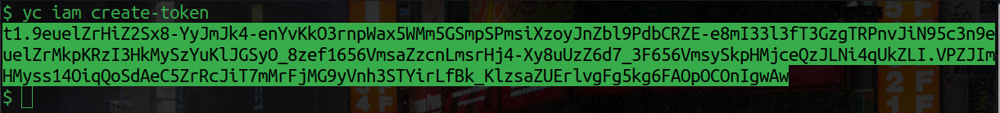

## Создание и удаление кластера для установки docker-контейнеров в Yandex.Cloud с помощью программы Terraform.
### Этапы создания и удаления кластера.

Создание кластера происходит в два этапа:
- Подготовка.
  На этом этапе вы проверяете, что необходимые программы установлены, выполняете получение и регистрацию токенов, настраиваете переменные в Terraform.
  
- Создание кластера.
  На этом этапе вы проверяете с помощью программы Terraform конфигурацию, создаёте план работы, запускаете создание кластера, проверяете наличие созданного кластера и получаете информацию о нём.
  
Удаление кластера происходит в один этап.
- Удаление кластера.
  Использование ресурсов в облаке Яндекс тарифицируется. Поэтому, если не удалить кластер, то с вашего депозитного счёта на аккаунте (не с банковской карты, а только то, что вы внесли на депозит в свой аккаунт) будут списываться деньги.
  
### Подготовка.
#### Необходимое программное обеспечение для создания кластера в облаке Yandex.Cloud.
Для того, чтобы выполнять действия по созданию кластера вам понадобятся следующие программы:
- Операционная система **Linux** или **MacOs**. Если у вас операционная система **Windows 10** версии 2004 и выше, или более новая Windows, то необходимо [установить WSL](https://learn.microsoft.com/ru-ru/windows/wsl/install)  - это поддержка Linux на Windows.
- Программа **YC** для работы с интерфейсом командной строки CLI (command line interface). Если вы в будущем будете читать документацию по Yandex.Cloud, то примеры с реализацией в CLI будут встречаться довольно часто. Если этой программы ещё нет у вас, то [установите](https://yandex.cloud/ru/docs/cli/operations/install-cli#linux_1) её.
- Программа **Terraform**. Это программа, которая обрабатывает файлы с инструкциями (манифесты), написанными в формате HCL (HashiCorp Configuration Language). С помощью Terraform мы будем создавать наш кластер в облаке Яндекс. Если у вас ещё нет этой программы, то [установите](https://developer.hashicorp.com/terraform/install) её.

#### Настройка переменных.
На этом этапе у вас должна быть зарегистрированная и активная учётная запись в Yandex.Cloud.
Если у вас есть учётная запись в облаке Яндекс, то вам доступен каталог, созданный по умолчанию. У этого каталога есть идентификационный номер **ID**, который мы сейчас с вами получим и будем использовать в дальнейшем.
1. Создайте текстовый файл, в который вы запишете cloud_id, folder_id, service_account_id и node_service_account_id. 
[Приступайте](https://yandex.cloud/ru/docs/cli/operations/profile/profile-create#interactive-create) к интерактивному созданию профиля. В результате создания профиля появится вся необходимая информация. 
```
token: y0_AgA...wvs7N4
cloud-id: b1g159pa15cd********
folder-id: b1g8o9jbt58********
compute-default-zone: ru-central1-b
```
Скопируйте в свой текстовый файл полученные cloud_id и folder_id.

2. Получите IAM-токен с помощью команды: 
```
yc iam create-token
```
После ввода команды вы должны получить примерно такой вывод:
<p align="center"></p>
Выделите IAM-токен и скопируйте его. IAM-токен - это выделенная часть на изображении:
<p align="center"></p>

Запишите IAM-токен в свой текстовый файл. **Но помните, этот токен работает только 12 часов.** Потом нужно получать новый IAM-токен. Поэтому, команду *yc iam create-token* можете записать рядом.

3. [Создайте](https://yandex.cloud/ru/docs/iam/operations/sa/create) сервисный аккаунт с ролью *admin*.
После создания сервисного аккаунта выполните команду: 
```
yc iam service-account list
```
Скопируйте *ID* созданного аккаунта и запишите в свой текстовый файл, в параметр service_account_id.

4. Из этого репозитория скопируйте два файла: *main.tf* и *variables.tf*.

5. Отредактируйте файл **variables.tf**, в котором нужно заполнить значения *default* в пяти переменных:
- token
- cloud_id
- folder_id
- service_account_id
- node_service_account_id

Все значения мы получили ранее и записали в наш текстовый файл. Переменную *zone* можно не редактировать - она уже правильно заполнена.

На этом, подготовка завершена. Мы можем переходить к созданию кластера.

### Создание кластера.
#### Инициализация Terraform.
Для работы Terraform, его нужно сперва инициализировать. Во время инициализации terraform обрабатывает имеющиеся файлы с расширением *tf* и создаёт предварительную конфигурацию вашего будущего проекта.
Откройте командную строку в той папке, где у вас лежат файлы *main.tf* и *variables.tf*. 

Запустите команду:
```
terraform init
```
На этом инициализация завершена. Можно приступать к созданию кластера.

#### Создание кластера.
Осталась одна команда =)
Выполните команду: 
```
terraform apply
```

Terraform покажет вам план действий, которые будут выполнены, и запросит подтверждение. Наберите *yes* и нажмите ввод.
Далее будет достаточно долгое создание кластера - вам нужно приготовиться подождать.

На этом, создание кластера завершено.

Если, в процессе создания возникли ошибки, то, скорее всего они связаны с токеном, время жизни которого истекло и нужно получить новый, или с ошибками копирования значений в файле *variables.tf*. Внимательно проверьте все значения.

#### Проверка создания кластера.
Для проверки создания мы можем получить информацию о нашем кластере от облака Яндекс.
Выполните команду:
```
yc managed-kubernetes cluster list
```

Вы получите таблицу, в которой будет указан ваш кластер.

### Удаление кластера.
Для удаления кластера, вам необходимо открыть интерфейс командной строки в папке с файлами Terraform нашего кластера, *main.tf*, *variables.tf* и другие.
Для удаления кластера выполните команду:
```
terraform destroy
```

Удаление кластера тоже занимает какое-то время. Подождите, пока программа не закончит свою работу.

По завершении работы, проверьте удаление, выполнив команду:
```
yc managed-kubernetes cluster list
```

У вас должна быть пустая таблица.

### Заключение
В результате получился кластер с одной группой узлов, с одним узлом, но с возможностью автоматического масштабирования до 4 узлов.
Вы можете регулировать производительность и масштабирование кластера в файле *main.tf*.

Производительность:
```
resources {
  cores         = 4
  core_fraction = 50
  memory        = 4
}
boot_disk {
  size = 32
  type = "network-hdd"
}
```

Масштабирование:
```
scale_policy {
  auto_scale {
    min     = 1
    max     = 4
    initial = 1
  }
}
```

В данной конфигурации стоимость эксплуатации одного узла в месяц получилась относительно небольшой.
<p align="center"></p>


### Дополнительная информация.
Процесс получения необходимых данных токенов, id и т.д. можно автоматизировать.
Более подробно читайте [здесь](https://yandex.cloud/ru/docs/managed-kubernetes/tutorials/terraform-modules#get-credentials), в разделе *"Получите данные для аутентификации"*.

# Спасибо за внимание. =)
